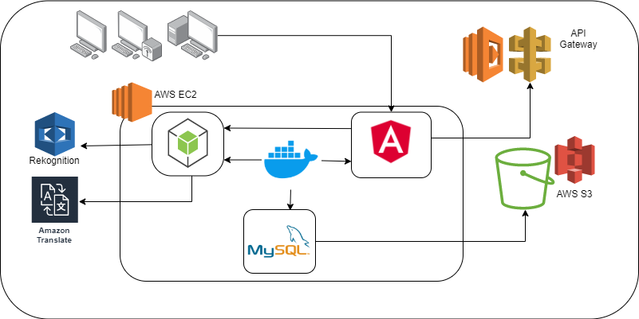
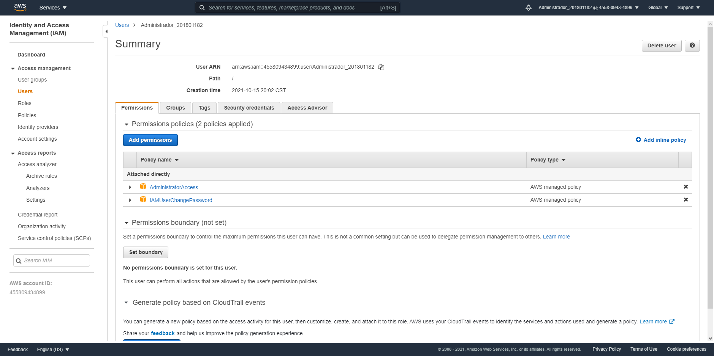
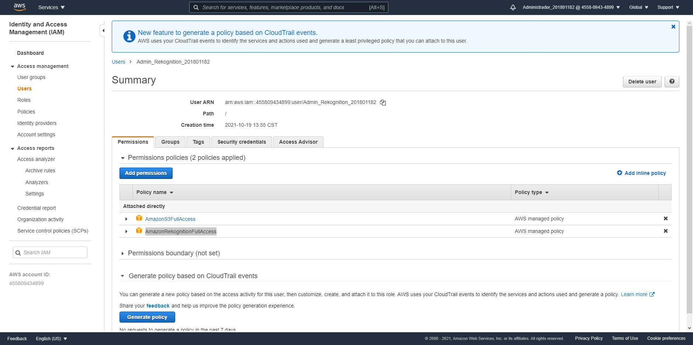
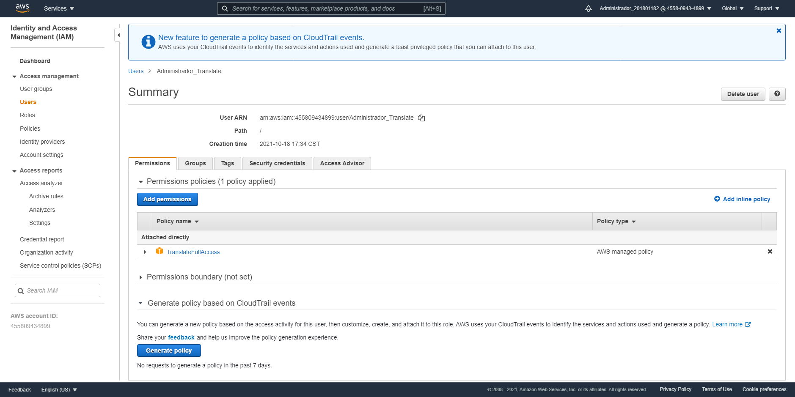
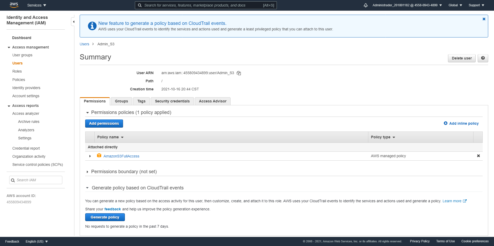
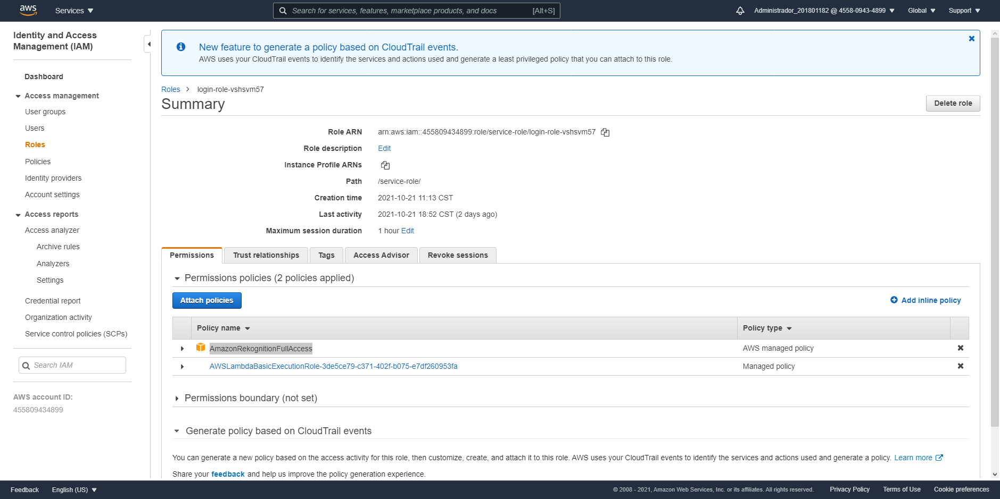

# Manual Técnico 

- [Objetivos](#objetivos)
- [Arquitectura](#arquitectura)
- [Usuarios IAM](#usuarios-iam)

## Objetivos 

### Objetivo General 

- Aplicar y conocer nuevas técnologias en la nube de forma simple, segura y rápida.

### Objetivos Especifícos

- Aplicar conocimientos adquiridos en el curso de Seminario de Sistemas 1.

- Integración de servicios en Amazon Web Services.

- Aplicar técnologias de la nube en un entorno real.

## Arquitectura

 
    
    
 Arquitectura 

 

La arquitectura de la aplicación fue realizada usando Angular como framework para el lado del frontend y Nodejs para el lado del backend. Estos servicios se levantaron en contenedores usando docker-compose y docker para poder empaquetar la aplicación. Se utilizo Rekoognition en API Gateway para poder realizar la funcionalidad de Inicio de Sesión con reconocimiento facial. También se utilizo Rekognition para poder filtar las publicaciones por etiquetas. 

Se utilizo para la base de datos MySQL, asi mismo se utizo docker-compose para poder levantarla dentro de una EC2 en AWS. Se utilizó Amazon Translate para poder traducir las publicaciones al idioma español. 

### Modelo Relacional Base de Datos 

La base de datos de la aplicación fue implementada con MySQL, contiene las siguientes tablas. 
- USUARIO
- AMISTAD 
- MENSAJE 
- PUBLICACION
- ETIQUETA

 
    
    
 Base de datos 

 

## Usuarios IAM

### Administrador_201801182 

Se creo para poder dar acceso a la consola de Administración de AWS. 

#### Política Asociada 

- AdministratorAccess 
- IAMUserChangePassword

 
    
    
 Administrador_201801182 

 

### Admin_Rekognition_201801182

Se creo para poder administrar Rekognition para el reconocimiento de etiquetas de la imagen de una publicación.   

#### Política Asociada 

- AmazonS3FullAccess
- AmazonRekognitionFullAccess

 
    
    
  Admin_Rekognition_201801182 

 

### Administrador_Translate

Se creo para poder manejar la funcionalidad de traducción desde programación. 

#### Política Asociada 

- TranslateFullAccess

 
    
    
  Administrador_Translate 

 

### Admin_S3

Se creo para poder administrar S3 desde programación.

#### Política Asociada 

- AmazonS3FullAccess

 
    
    
  Admin_S3 

 

## Roles

### login-role-vshsvm57

Utilizado para implementar funcionalidad de inicio de sesión utilizando el servicio de AWS Lambda. 

#### Política Asociada 

- AmazonRekognitionFullAccess
- AWSLambdaBasicExecutionRole

 
    
    
  Rol: login 

 